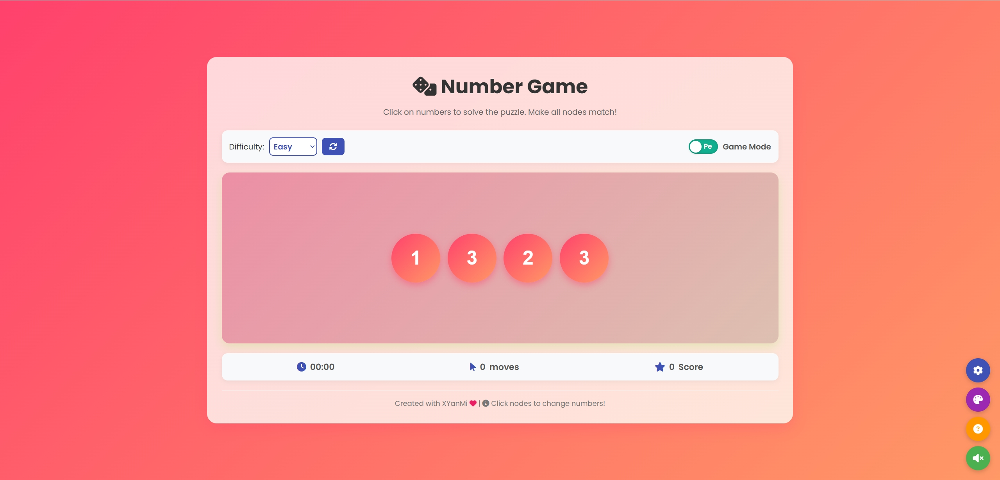
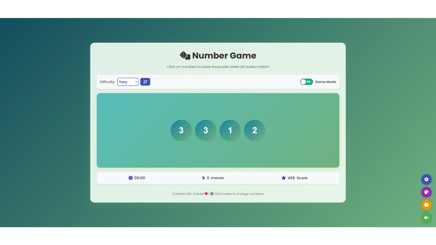
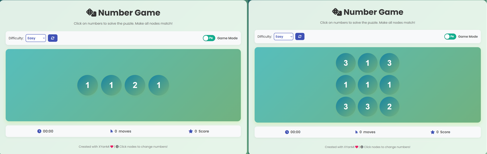
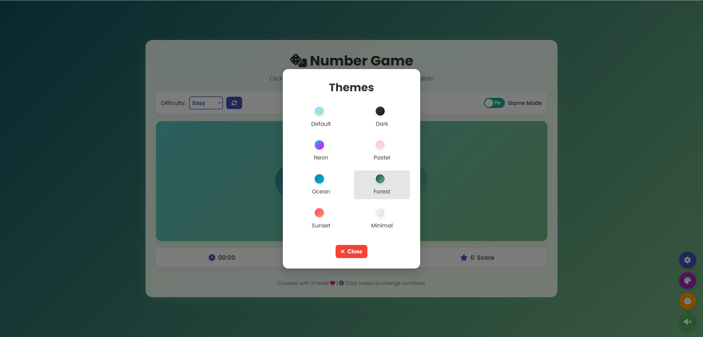
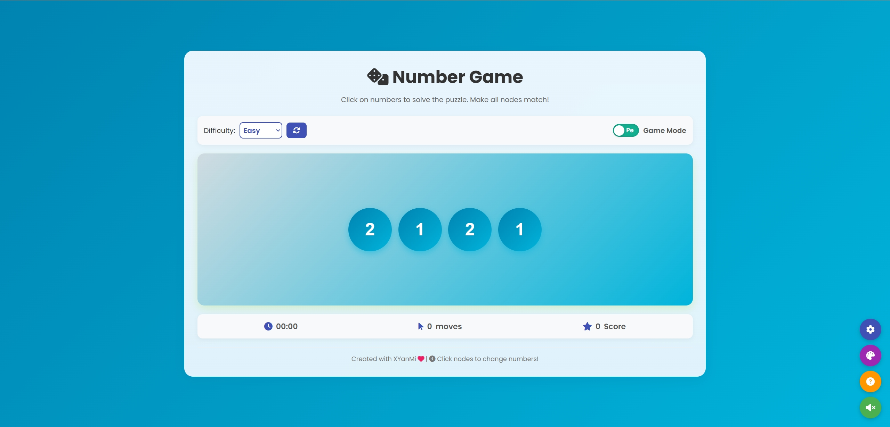

# Number Game
This program is a number game.

The rules of the game are simple, which is just to make the numbers of all squares the same.

- What we can do only is click the square, this makes the number of the neighbor and it plus 1.

  

- There are some settings:
  
  1. Change the total number of squares, and click the refresh button to restart the game.
  2. "Pe" or "Fix" represent periodic boundary and fixed boundary respectively, for example:
     
     "Pe": Click the 1st square, the 2nd and the last are its neighbors.
     
     "Fix": Just the 2nd is the neighbor of the 1st square.
## 05/03/25 New Features

### |*| New UI

### 1. Game Dimension Selection
The game now supports both 1D and 2D modes:

- 1D Mode : Squares are arranged in a linear sequence
- 2D Mode : Squares are arranged in a grid layout

### 2. Theme Switching

The game supports multiple visual themes that can be switched by clicking the palette button.

### 3. Others

+ Victory Screen: Confetti effect, Game statistics (time, moves, score), New record notification
+ Sound Effects in clicking, success .....

## Game Tips
1. Observe the initial number distribution to find the best starting point
2. In 1D mode, starting from one end is usually easier to control
3. In 2D mode, starting from a corner or edge may be more strategic
4. Try to make all numbers adjacent values first, then make them equal in one move
## Development Information
This game is developed using HTML, CSS, and JavaScript, and requires no dependencies to run